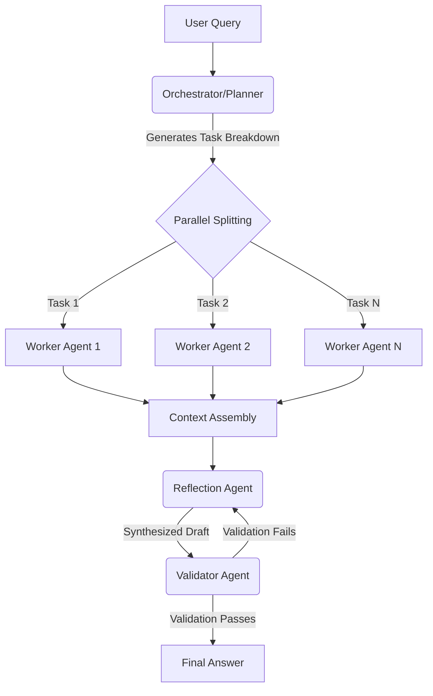

# Directed Acyclic Graph (DAG) Agent Execution Flow

This diagram outlines how the Orchestrator distributes tasks and how parallel execution is folded back into a sequential loop for Reflection and Validation.

### Explaining the Steps

1. **Planner**: Decides *what* needs to be done. It isolates dependencies so workers don't block each other.
2. **Workers**: Operate in an isolated context. They rely strictly on their individual system prompts and the sub-task assigned to them without awareness of the overarching problem.
3. **Reflection**: The "Merge" phase. It takes disparate JSONs, strings, and texts from all workers and synthesizes them into a unified draft. 
4. **Validator**: Applies hard constraints. If the query strictly asked for Python code and the reflection outputs Java, the Validator kicks it back. Once correct, it terminates.
